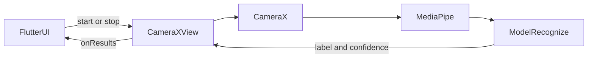

# Arabic Sign Language Interpreter

Real-time Arabic Sign Language recognition system with two models:

- **Alphabet Model**: Single-frame inference (hand landmarks only)
- **Word Model**: Sequence inference (hand + pose landmarks, 30 frames)

Both exported to TensorFlow Lite and integrated into a Flutter/Kotlin mobile app using **MethodChannel** and **CameraX**.

---
## Demo
| Alphabet Demo | Main Screen | Quiz Screen |
| :---: | :---: | :---: |
|  |  |  |

| Quiz Screen | Phrase Screen | App Demo |
| :---: | :---: | :---: |
|  |  | <video  src="https://github.com/user-attachments/assets/4dd65778-bcce-4703-a51c-a8a3baee0d6a" width="150"> |

## 📂 Project Structure

```
.
├── AlphabetTraining.ipynb       # Notebook for alphabet model training
├── WordTraining.ipynb           # Notebook for word model training
├── LandMarkHelper.kt            # MediaPipe integration (hand + pose landmarks)
├── CameraXView.kt               # CameraX + MethodChannel + TFLite inference
├── CameraXFactory.kt            # Registers CameraXView for Flutter
├── MainActivity.kt              # Registers platform view in Flutter engine
├── ModelRecognize.kt            # Loads & runs TFLite alphabet/word models
```

---

## 🔄 How It Works



### Steps

1. **Flutter**: Sends `startDetection` / `stopDetection` via MethodChannel.  
2. **CameraXView**: Captures frames using CameraX, forwards to MediaPipe.  
3. **LandMarkHelper**: Extracts hand (and pose) landmarks.  
4. **ModelRecognize**:  
   - Alphabet → predict every 5th frame (`[1,63,1]`)  
   - Word → buffer 30 frames (`[1,30,162]`)  
   - Returns label + confidence.  
5. **Flutter**: Displays result in real-time.

---

## 🏋️ Training

### Alphabet Model
- Input: 63 features (21 hand landmarks × (x,y,z))
- Notebook: `AlphabetTraining.ipynb`
- Output: `[1,63,1]` → softmax classifier

### Word Model
- Input: 30 × 162 features (hand + pose per frame, 30 frames)
- Notebook: `WordTraining.ipynb`
- Output: `[1,30,162]` → Softmax Classifier


## Confusion Matrix
| Alphabet CM | Phrases CM |
| :---: | :---: |
|  |  |

---

## 📊 Data Shapes

| Mode      | Input Shape     | Frequency         | Notes                              |
|-----------|-----------------|-------------------|------------------------------------|
| Alphabet  | `[1, 63, 1]`    | Every 5th frame   | Hand landmarks only                |
| Word      | `[1, 30, 162]`  | After 30 frames   | Hand + pose landmarks (temporal)   |

---

## 🚀 Mobile App Integration

- **PlatformView** registered in `MainActivity.kt`  
- **CameraXView** bridges Flutter ↔ Android  
- **MethodChannel ("camerax_channel")** used for commands + results  
- **Results**: `{ label, confidence, inferenceTime, landmarks[] }`

Example Flutter Dart usage:

```dart
static const channel = MethodChannel('camerax_channel');

Future<void> start() async {
  await channel.invokeMethod("startDetection");
  channel.setMethodCallHandler((call) async {
    if (call.method == "onResults") {
      final result = Map<String, dynamic>.from(call.arguments);
      print("Label: ${result["label"]}, Confidence: ${result["confidence"]}");
    }
  });
}

Future<void> stop() async {
  await channel.invokeMethod("stopDetection");
}
```

---

## 📌 Future Work

- Expand word vocabulary  
- Add temporal smoothing in app  
- Optimize with GPU / NNAPI delegates  
- Create a data collection tool for more robust datasets  

---

## 📜 License

MIT License.
